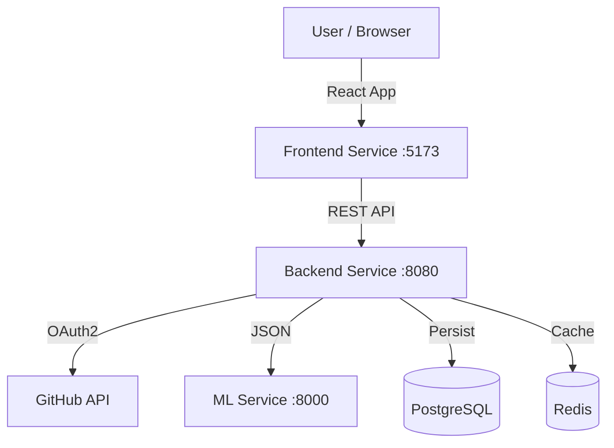

# Dynamic Portfolio & ML Recommendation System

A full-stack application that dynamically generates a developer portfolio based on GitHub activity and provides AI-powered career and skill recommendations.


## 🚀 Features

- **Real-time GitHub Sync**: Fetches repositories, languages, and topics directly from GitHub.
- **ML-Powered Recommendations**:
  - **Career Paths**: Suggests roles (e.g., Frontend Developer, DevOps Engineer) based on your code.
  - **Skill Analysis**: Quantifies proficiency in languages and technologies.
  - **Gap Analysis**: Identifies missing skills for desired career paths.
- **Interactive Dashboard**: Visualizes skills, projects, and learning resources.
- **Secure Authentication**: GitHub OAuth2 integration.

## 🏗 Architecture

The system consists of three main microservices:



### Tech Stack

- **Frontend**: React, TypeScript, Vite, Recharts, Lucide React
- **Backend**: Java 17, Spring Boot 3, Spring Security (OAuth2), Spring Data JPA
- **ML Service**: Python 3.10, FastAPI, Scikit-learn, Pandas, NumPy
- **Database**: PostgreSQL 15
- **Caching**: Redis

## 🛠 Prerequisites

- **Java 17+** & Maven
- **Node.js 18+** & npm
- **Python 3.10+**
- **Docker** & Docker Compose

## 🚦 Getting Started

### 1. Clone the Repository
```bash
git clone https://github.com/OnuegbuUdochukwu/Dynamic_Portfolio.git
cd Dynamic_Portfolio
```

### 2. Start Infrastructure (Database & Redis)
```bash
docker-compose up -d
```

### 3. Configure Environment
You need a GitHub OAuth App.
1. Go to [GitHub Developer Settings](https://github.com/settings/developers).
2. Create a New OAuth App:
   - **Homepage URL**: `http://localhost:5173`
   - **Callback URL**: `http://localhost:8080/login/oauth2/code/github`
3. Note the `Client ID` and `Client Secret`.

### 4. Start ML Service
```bash
cd ml-service
python -m venv .venv
source .venv/bin/activate  # Windows: .venv\Scripts\activate
pip install -r requirements.txt
python main.py
# Runs on http://localhost:8000
```

### 5. Start Backend Service
```bash
cd backend
export GITHUB_CLIENT_ID=your_client_id
export GITHUB_CLIENT_SECRET=your_client_secret
mvn spring-boot:run
# Runs on http://localhost:8080
```

### 6. Start Frontend
```bash
cd frontend
npm install
npm run dev
# Runs on http://localhost:5173
```

## 🧪 Usage

1. Open `http://localhost:5173` in your browser.
2. Click **"Sign in with GitHub"**.
3. Once logged in, click **"Sync GitHub"** to fetch your latest repositories.
4. Explore the **Recommendations** tab to see:
   - **Careers**: Top career matches with confidence scores.
   - **Skills**: Detailed breakdown of your technical strengths.
   - **Projects**: Ideas to build next based on your profile.
   - **Learning**: Curated resources to fill skill gaps.

## 🐳 Deployment

The application is fully containerized and ready for deployment using Docker Compose.

### Production Deployment

1. **Build and Start Services**:
   ```bash
   docker-compose -f docker-compose.prod.yml up -d --build
   ```

2. **Access the Application**:
   - Frontend: `http://localhost:3000`
   - Backend API: `http://localhost:8080`
   - ML Service: `http://localhost:8000`

### Environment Variables
Ensure you set the following environment variables in your deployment environment or a `.env` file:
- `GITHUB_CLIENT_ID`
- `GITHUB_CLIENT_SECRET`
- `POSTGRES_PASSWORD` (optional, defaults to `password`)

## 🤝 Contributing

1. Fork the repository.
2. Create a feature branch (`git checkout -b feature/amazing-feature`).
3. Commit your changes (`git commit -m 'Add amazing feature'`).
4. Push to the branch (`git push origin feature/amazing-feature`).
5. Open a Pull Request.

## 📄 License

Distributed under the MIT License. See `LICENSE` for more information.
